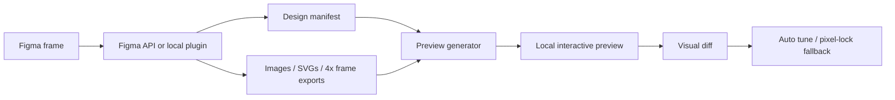

# Figma Pixel Bridge

[](https://nodejs.org/)
[](LICENSE)
[](#project-status)

Figma Pixel Bridge is a local, bidirectional design bridge for moving between Figma and frontend code. It generates high-fidelity, previewable UI from Figma frames, and it also includes an experimental reverse bridge that can create editable Figma frames from local frontend/Pencil design data. It combines structured Figma metadata with high-resolution frame exports, so AI agents and developers can work from both the design tree and the visual source of truth.

Unlike pure "Figma JSON to divs" converters, this project uses a hybrid rendering strategy: keep an exact pixel-lock layer for visual parity, then layer editable reconstruction, assets, hotspots, route transitions, and visual regression checks on top. The reverse path uses a local bridge and Figma plugin to turn frontend/Pencil payloads back into editable Figma nodes.

## Why it exists

Figma-to-code workflows usually fail in the last 20%: image crops drift, icons blur, text rendering changes, effects flatten incorrectly, and complex visual layouts stop matching the original file. Figma Pixel Bridge is built for that fidelity gap.

It is useful when you need to:

- Export a Figma frame into a runnable local preview.
- Send local frontend/Pencil design data back into Figma as editable frames.
- Preserve sharp images, SVG icons, and full-frame visual fidelity.
- Give an AI coding agent structured design context and local assets.
- Validate output against an exported Figma reference.
- Fall back to pixel-lock rendering when editable reconstruction is not accurate enough.

## How it works



Core layers:

- **Design manifest** - normalized nodes, text, fills, strokes, radii, typography, geometry, components, and asset references.
- **Asset exporter** - original image fills, SVG vector exports, and high-resolution frame exports.
- **Editable layer** - HTML/CSS reconstruction for inspection and future conversion work.
- **Pixel-lock layer** - exact Figma SVG/PNG frame export used as the visual source of truth.
- **Interaction layer** - transparent hotspots over the exact layer for route changes and UI interactions.
- **Visual diff layer** - compares generated output with the Figma export and records a report.

See [`docs/architecture.md`](docs/architecture.md) for a deeper technical breakdown.

## Features

- Figma URL parsing for `fileKey` and `node-id`.
- Figma REST API sync for files, nodes, images, and exports.
- Figma plugin bridge for rate-limit fallback and selected-frame export.
- Local asset pipeline for images, SVG icons, and high-resolution frames.
- Manifest-driven preview generator.
- Pixel-lock-first preview mode for complex visual designs.
- Visual similarity checks and auto-tune fallback.
- Cached high-resolution asset reuse when the Figma revision has not changed.
- Lazy loading and hover prefetch for inactive 4x frame exports.
- Optional auto-interaction enrichment for hover, press, hotspots, and same-level smart transitions.
- MCP-style stdio server exposing `figma.sync`, `figma.analyze`, and `figma.generatePreview`.
- Bidirectional workflow: Figma-to-preview export plus experimental frontend/Pencil-to-Figma import.

## Project status

This is an experimental developer tool. The pixel-lock preview path is the most reliable path for visual fidelity. Full editable code reconstruction is intentionally treated as a progressive enhancement, because browser rendering will not always match Figma's rendering engine exactly.

## Requirements

- Node.js 20+
- Access to the Figma file you want to export
- No token required for the local Figma plugin bridge path
- A Figma Personal Access Token only if you use the REST API sync path

## Quick start

### Beginner path: no token, no official MCP quota

This is the recommended first run. The Figma plugin exports the selected frame to local files, then your AI coding tool reads those files from this project folder.

```bash
git clone https://github.com/francoyeoh7/figma-pixel-bridge.git
cd figma-pixel-bridge
npm install
npm run plugin-bridge
```

In Figma:

1. Open `Plugins > Development > Import plugin from manifest...`.
2. Select `figma-plugin/manifest.json`.
3. Run **Figma Pixel Bridge Exporter**.
4. Select a frame, click **检查本地 Bridge**, then click **开始导出到项目**.

After export, open this project folder in your AI coding tool and say:

```text
请读取 public/figma-assets/design-manifest.json、public/figma-assets/frames 和 public/figma-assets/images，把刚导出的 Figma UI 转成可运行前端。优先保证 95%+ 视觉还原，图片使用 public 里的高清资产，可点击区域按 manifest/hotspots 和 UI 语义补齐。如果看到 Figma API/MCP 限额提示，不要调用官方 Figma MCP，直接使用本地 plugin bridge 已导出的文件。
```

Preview the generated output:

```bash
npm run serve
```

Open:

```text
http://localhost:4173/
```

### REST API path: optional

Use this path when you want automated Figma REST API sync and have a Figma token available:

```bash
cp .env.example .env.local
```

Edit `.env.local`:

```bash
FIGMA_TOKEN=your_figma_personal_access_token
FIGMA_URL=https://www.figma.com/design/FILE_KEY/FILE_NAME?node-id=0-1
FIGMA_VISUAL_THRESHOLD=95
```

Run the pipeline:

```bash
npm test
npm run sync
npm run auto-tune
npm run serve
```

Open:

```text
http://localhost:4173/
```

## How beginners should use it with AI

The plugin does not magically run an AI model by itself. It prepares the design data that an AI coding agent needs: manifest, images, icons, high-resolution frame exports, routes, and hotspots.

Think of the workflow as:

```text
Figma plugin export -> local manifest/assets -> AI coding tool -> runnable frontend
```

Good starter prompts:

```text
把刚导出的 Figma UI 转成 React/Vite 页面。读取 public/figma-assets/design-manifest.json 和 public/figma-assets 下的图片、图标、frames。先保证视觉还原，再补交互。
```

```text
基于已有预览继续优化：保留高清 frame/pixel-lock 兜底层，把看起来可点击的区域补上 hover、press、路由跳转和同级智能动画，风格要匹配原 UI。
```

```text
如果官方 Figma API 或 MCP 报额度不足，不要停。这个项目已经通过本地插件桥接导出了文件，请直接使用本地 manifest/assets。
```

For the reverse direction, tell the AI:

```text
把当前前端页面整理成 Figma import payload，然后通过本地 figma:import-bridge 导入到当前 Figma 文件。尽量保留文字、图片、颜色、圆角、尺寸和层级。
```

See [`docs/getting-started.md`](docs/getting-started.md) for the full beginner guide.

## CLI usage

NPM scripts:

```bash
npm run sync          # Fetch Figma data, export assets, generate preview
npm run serve         # Serve generated/figma-preview on localhost:4173
npm run plugin-bridge # Start the local Figma plugin bridge on localhost:4758
npm run auto-tune     # Run visual self-check and pixel-lock fallback
npm run mcp           # Start the MCP-style stdio server
```

Direct CLI:

```bash
node scripts/figma-pixel.mjs sync --url "https://www.figma.com/design/...?...node-id=0-1"
node scripts/figma-pixel.mjs sync --url "https://www.figma.com/design/...?...node-id=0-1" --auto-interactions --interaction-profile game
node scripts/figma-pixel.mjs serve --port 4173
node scripts/figma-pixel.mjs plugin-bridge --port 4758
node scripts/figma-pixel.mjs verify --threshold 95
node scripts/figma-pixel.mjs auto-tune --threshold 95
node scripts/figma-pixel.mjs mcp
```

Packaged binary names:

```bash
figma-pixel sync --url "https://www.figma.com/design/...?...node-id=0-1"
figma-pixel serve
figma-pixel plugin-bridge
figma-pixel auto-tune
figma-pixel mcp
```

`sync` reuses local 4x PNG/SVG/image exports when the Figma file revision has not changed. Use `--no-cache` when you intentionally need to force fresh downloads.

Use `--auto-interactions` when a user wants the generated preview to add feedback to clickable-looking surfaces. You can tune motion style with `--interaction-profile game|social|product`.

## Output structure

`npm run sync` creates runtime output that is intentionally ignored by git:

```text
public/figma-assets/
  design-manifest.json
  sync-summary.json
  images/
  icons/
  frames/

generated/figma-preview/
  index.html
  design-manifest.json

reports/figma-visual-diff/
  report.md
  baseline.png
  actual.png
  diff.png
```

## Figma to frontend workflow

Use this path when the REST API is rate-limited or when you want to export the current Figma selection from inside Figma.

```bash
npm run plugin-bridge
```

Then in Figma:

1. Open `Plugins > Development > Import plugin from manifest...`.
2. Select `figma-plugin/manifest.json`.
3. Run **Figma Pixel Bridge Exporter**.
4. Select a frame or export the page's top-level frames.

The bridge receives the plugin payload, writes local assets, updates the manifest, and regenerates the preview.

## Frontend to Figma workflow

The reverse bridge is experimental, but it is important to the project direction: local frontend/Pencil design data can be served as a payload and imported into the current Figma file as editable nodes.

```bash
npm run figma:import-bridge
```

Then in Figma:

1. Open `Plugins > Development > Import plugin from manifest...`.
2. Select `figma-importer-plugin/manifest.json`.
3. Run **Figma Pixel Bridge Importer**.
4. Import the local payload into a new page or the current file.

This makes the project a two-way bridge rather than only a Figma export tool.

## MCP-style server

Start the stdio server:

```bash
npm run mcp
```

Available tools:

| Tool | Purpose |
| --- | --- |
| `figma.sync` | Fetch Figma data, export assets, and generate preview files. |
| `figma.analyze` | Fetch and normalize Figma data without binary asset downloads. |
| `figma.generatePreview` | Regenerate preview HTML from the latest manifest. |

Example JSON-RPC request:

```json
{"jsonrpc":"2.0","id":1,"method":"tools/list","params":{}}
```

## Security notes

- Keep Figma tokens in `.env.local`; never commit them.
- Runtime exports can contain private design assets, so `public/figma-assets/`, `generated/`, and `reports/` are ignored by default.
- The plugin bridge only listens locally and is intended for trusted development machines.
- If a token is pasted into a chat, screenshot, or public repo by mistake, revoke it in Figma and create a new one.

## Limitations

- Pixel-lock mode preserves visual fidelity, but it is not the same as fully editable production UI code.
- Editable reconstruction can drift for complex masks, blend modes, text antialiasing, effects, and responsive behavior.
- The Figma REST API can be rate-limited; use the plugin bridge fallback when needed.
- The generated preview is a local artifact, not a complete application framework integration.

## Repository layout

```text
scripts/
  figma-pixel.mjs              # CLI entrypoint
  figma-sync.mjs               # Figma API sync pipeline
  figma-plugin-bridge.mjs      # Local bridge for Figma plugin export
  figma-mcp-server.mjs         # MCP-style stdio server
  figma-tools/                 # Analyzer, API client, preview, visual diff

figma-plugin/                  # Figma exporter plugin
figma-importer-plugin/         # Experimental reverse importer plugin
docs/                          # Architecture and workflow docs
tests/                         # Node test suite
```

## Development

```bash
npm test
npm run pack:dry
```

## License

MIT. See [`LICENSE`](LICENSE).
