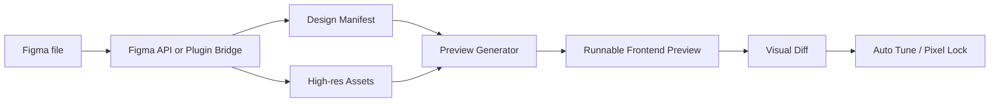

# Architecture

Figma Pixel Bridge is a high-fidelity Figma-to-frontend pipeline. It is not a pure "node JSON to divs" converter, and it is not the official Figma MCP. It combines structured design extraction with Figma's own rendered exports.

## Pipeline

## Layers

- **Design manifest**: normalized frame, node, text, fill, stroke, radius, effect, typography, component, and asset references.
- **Asset layer**: original image fills, SVG vector exports, and 4x frame/root exports.
- **Editable layer**: HTML/CSS reconstruction for inspectability and later conversion work.
- **Pixel-lock layer**: exact SVG/PNG frame export used to preserve final visual output.
- **Interaction layer**: transparent hotspots over the pixel-lock layer so the preview can remain interactive.
- **FX layer**: optional motion such as scan lines, route transitions, and click feedback.
- **Visual diff layer**: compares outputs and keeps the preview above the configured threshold.

## Connector semantics

Pixel Bridge has two ways to obtain Figma data:

- **REST API sync**: uses the user's Figma token and therefore uses Figma REST API quota.
- **Local plugin bridge**: runs inside Figma and sends selected/page exports to `localhost`; it does not use the REST API token or official Figma MCP quota.

The local MCP-compatible server is an adapter around Pixel Bridge's own CLI pipeline. It should be described as "MCP-compatible" or "local AI-tool adapter", not as the official Figma MCP.

## Speed without losing fidelity

The bridge keeps Figma's rendered 4x exports as the visual source of truth, but avoids paying their cost repeatedly. If the Figma file revision is unchanged, existing local image, SVG, and frame exports are reused. In the generated preview, only the active pixel-lock frame loads eagerly; inactive frames keep their original 4x source in `data-src` and are loaded on navigation intent, hover prefetch, or route activation.

## Opt-in interaction enrichment

When `autoInteractions` is enabled, the preview generator adds feedback hotspots over button-like, card-like, and selectable surfaces while preserving the exact pixel layer underneath. It also infers whether screens are same-level states, such as `2.1`, `2.2`, and `2.3` gunsmith views, and uses state-reveal transitions instead of hard page cuts. Motion intensity adapts by profile: game, social, or product.

## Why it is more accurate than plain node extraction

Plain node extraction loses information at the render boundary: font antialiasing, blend modes, image crop behavior, masks, vector export details, and Figma's own effect compositing. Pixel Bridge treats Figma's rendered export as the source of visual truth, then layers semantic structure and interaction on top.
