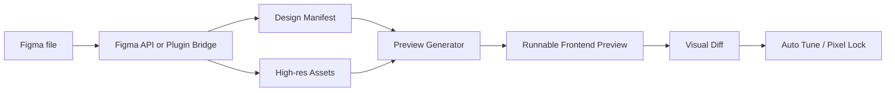

# Architecture

Figma Pixel Bridge is a high-fidelity Figma-to-frontend pipeline. It is not a pure "node JSON to divs" converter. It combines structured design extraction with Figma's own rendered exports.

## Pipeline

## Layers

- **Design manifest**: normalized frame, node, text, fill, stroke, radius, effect, typography, component, and asset references.
- **Asset layer**: original image fills, SVG vector exports, and 4x frame/root exports.
- **Editable layer**: HTML/CSS reconstruction for inspectability and later conversion work.
- **Pixel-lock layer**: exact SVG/PNG frame export used to preserve final visual output.
- **Interaction layer**: transparent hotspots over the pixel-lock layer so the preview can remain interactive.
- **FX layer**: optional motion such as scan lines, route transitions, and click feedback.
- **Visual diff layer**: compares outputs and keeps the preview above the configured threshold.

## Why it is more accurate than plain node extraction

Plain node extraction loses information at the render boundary: font antialiasing, blend modes, image crop behavior, masks, vector export details, and Figma's own effect compositing. Pixel Bridge treats Figma's rendered export as the source of visual truth, then layers semantic structure and interaction on top.
