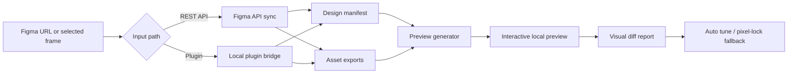

# Architecture

Figma Pixel Bridge is a local, high-fidelity Figma-to-frontend pipeline. It is designed around one principle: Figma's rendered frame export is the visual source of truth, while the node tree provides structure, metadata, and interaction targets.

## Goals

- Extract enough Figma structure for AI agents and developers to understand the UI.
- Export assets at high enough quality to avoid blurred backgrounds, icons, and character art.
- Produce a runnable local preview quickly.
- Preserve visual parity even when editable HTML/CSS reconstruction is imperfect.
- Provide a repeatable visual self-check instead of relying only on manual inspection.

## Pipeline



## Main components

### Figma API sync

`figma-sync.mjs` reads the configured Figma file, hydrates selected nodes, collects asset candidates, exports binary assets, and writes the normalized manifest.

### Plugin bridge

`figma-plugin-bridge.mjs` receives payloads from the local Figma plugin. This is useful when API rate limits block the REST flow or when exporting the current Figma selection is more reliable.

### Design manifest

The manifest is the normalized contract between extraction and rendering. It records:

- root frame size and origin
- nodes and absolute geometry
- text content and typography
- fills, strokes, opacity, effects, and corner radii
- component metadata
- local image, SVG, and frame export paths

### Asset layer

The asset pipeline writes local files for:

- original image fills
- SVG vector/icon exports
- high-resolution root/frame PNG exports
- exact SVG frame exports from plugin mode

### Preview generator

`preview-generator.mjs` builds a local HTML preview with multiple layers:

| Layer | Purpose |
| --- | --- |
| Editable reconstruction | HTML/CSS representation of extracted nodes. |
| Pixel-lock layer | Exact exported Figma frame for visual fidelity. |
| Interaction layer | Transparent hotspots for route changes and UI actions. |
| FX layer | Optional scan/rain/click/transition effects. |
| Inspector panel | Hidden debug panel for colors, typography, radii, and routes. |

### Visual diff and auto tune

`figma-verify.mjs` compares image outputs and writes a visual report. `figma-auto-tune.mjs` keeps the preview in pixel-lock-first mode when editable reconstruction falls below the configured threshold.

## Why this differs from plain node-to-code conversion

Plain node extraction is useful but incomplete. It can lose information at the render boundary: image crop behavior, vector export details, masks, blend modes, shadows, text antialiasing, and Figma's own effect compositing.

Figma Pixel Bridge treats the exported Figma frame as the fidelity anchor. The generated preview can still expose structured nodes and interactions, but it does not pretend that every complex design can be perfectly reconstructed as plain divs on the first pass.

## Data flow

```text
.env.local / CLI args
  -> Figma config
  -> API sync or plugin bridge
  -> public/figma-assets/design-manifest.json
  -> generated/figma-preview/index.html
  -> reports/figma-visual-diff/report.md
```

## Security model

- Tokens stay in `.env.local` or process environment variables.
- Runtime assets are ignored by git because they may include private design material.
- Local bridge servers are development tools and should not be exposed publicly.
- Error messages redact token-like URL parameters where possible.
